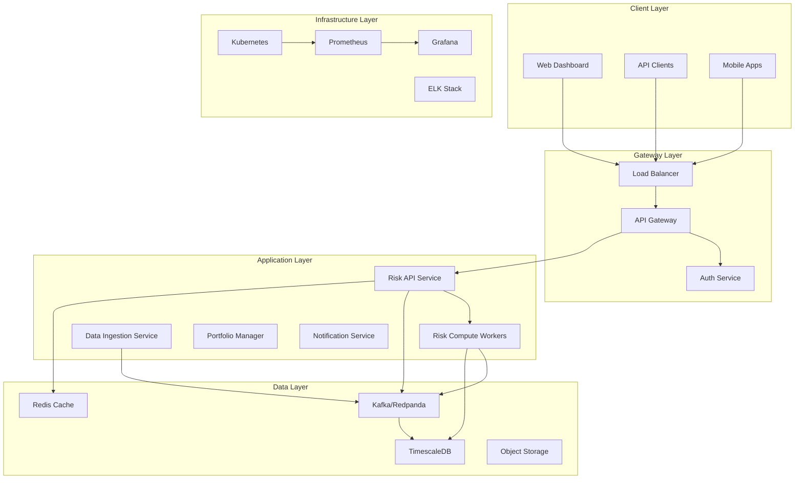

# RiskRadar Enterprise

[](https://opensource.org/licenses/MIT)
[](https://www.python.org/downloads/)
[](https://fastapi.tiangolo.com/)
[](https://www.docker.com/)
[](https://kubernetes.io/)

## 🚀 Overview

RiskRadar Enterprise is a production-grade, cloud-native risk management platform designed for institutional-level portfolio analysis and real-time risk monitoring. Built with microservices architecture, event-driven design, and enterprise-grade reliability.

### Key Features

- **Real-time Risk Analytics**: Sub-second calculation of VaR, CVaR, Sharpe ratio, and custom risk metrics
- **Multi-Asset Support**: Equities, fixed income, derivatives, alternatives, and crypto assets
- **Scalable Architecture**: Horizontally scalable microservices with Kubernetes orchestration
- **Event-Driven Processing**: Apache Kafka/Redpanda for real-time event streaming
- **Enterprise Security**: OAuth2/OIDC, mTLS, secrets management, and audit logging
- **High Availability**: 99.99% uptime with multi-region deployment capability
- **Comprehensive Observability**: Metrics, logs, traces, and custom dashboards

## 🏗️ Architecture



## 📦 Services

### Core Services

| Service | Description | Technology | Port |
|---------|-------------|------------|------|
| Risk API | REST/WebSocket API for risk calculations | FastAPI, Python 3.11 | 8000 |
| Risk Compute Worker | Async processing of risk calculations | Celery, NumPy, Pandas | N/A |
| Data Ingestion | Market data collection and normalization | Python, AsyncIO | 8001 |
| Portfolio Manager | Portfolio CRUD and optimization | FastAPI, SQLAlchemy | 8002 |
| Event Publisher | Event streaming and pub/sub | Kafka Producer | N/A |
| Notification Service | Alerts and notifications | FastAPI, SendGrid, Twilio | 8003 |

### Infrastructure Services

| Service | Description | Technology |
|---------|-------------|------------|
| API Gateway | Request routing, rate limiting, auth | Kong/Envoy |
| Message Broker | Event streaming platform | Kafka/Redpanda |
| Time Series DB | Historical data storage | TimescaleDB |
| Cache | High-speed data cache | Redis Cluster |
| Monitoring | Metrics collection | Prometheus |
| Visualization | Dashboards and alerts | Grafana |
| Logging | Centralized logging | ELK Stack |
| Tracing | Distributed tracing | Jaeger |

## 🚀 Quick Start

### Prerequisites

- Docker 24.0+
- Docker Compose 2.20+
- Python 3.11+
- Node.js 18+ (for dashboard)
- kubectl 1.28+ (for Kubernetes deployment)

### Local Development Setup

1. **Clone the repository**
```bash
git clone https://github.com/your-org/riskradar-enterprise.git
cd riskradar-enterprise
```

2. **Set up environment variables**
```bash
cp .env.example .env
# Edit .env with your configuration
```

3. **Start infrastructure services**
```bash
make infra-up
```

4. **Run database migrations**
```bash
make db-migrate
```

5. **Start application services**
```bash
make services-up
```

6. **Access the services**
- API Documentation: http://localhost:8000/docs
- Grafana Dashboard: http://localhost:3000
- Kafka UI: http://localhost:8080

## 🛠️ Development

### Project Structure

```
RiskRadar-Enterprise/
├── services/              # Microservices
│   ├── risk-api/         # Risk calculation API
│   ├── risk-compute-worker/  # Async workers
│   ├── data-ingestion/   # Data collectors
│   └── ...
├── libs/                  # Shared libraries
│   ├── python/           # Python packages
│   ├── proto/            # Protocol buffers
│   └── schemas/          # Data schemas
├── infrastructure/        # IaC and deployment
│   ├── terraform/        # Cloud resources
│   ├── kubernetes/       # K8s manifests
│   └── helm/             # Helm charts
├── monitoring/           # Observability
│   ├── prometheus/       # Metrics
│   ├── grafana/         # Dashboards
│   └── elk/             # Logging
├── tests/               # Test suites
│   ├── integration/     # Integration tests
│   ├── performance/     # Load tests
│   └── chaos/          # Chaos engineering
└── docs/               # Documentation
```

### Running Tests

```bash
# Unit tests
make test-unit

# Integration tests
make test-integration

# Performance tests
make test-performance

# All tests
make test-all
```

### Code Quality

```bash
# Format code
make format

# Lint code
make lint

# Type checking
make typecheck

# Security scanning
make security-scan
```

## 📊 API Documentation

### Authentication

All API endpoints require authentication via JWT tokens:

```bash
curl -X POST https://api.riskradar.com/auth/token \
  -H "Content-Type: application/json" \
  -d '{"username": "user", "password": "pass"}'
```

### Example: Calculate Portfolio Risk

```bash
curl -X POST https://api.riskradar.com/v1/risk/calculate \
  -H "Authorization: Bearer <token>" \
  -H "Content-Type: application/json" \
  -d '{
    "portfolio_id": "123",
    "metrics": ["var", "cvar", "sharpe"],
    "confidence_level": 0.95,
    "horizon": "1d"
  }'
```

## 🚢 Deployment

### Kubernetes Deployment

```bash
# Create namespace
kubectl create namespace riskradar

# Deploy infrastructure
kubectl apply -k infrastructure/kubernetes/base

# Deploy services
helm install riskradar ./infrastructure/helm/charts/riskradar \
  --namespace riskradar \
  --values ./infrastructure/helm/values/production.yaml
```

### Cloud Deployment (AWS)

```bash
# Initialize Terraform
cd infrastructure/terraform/aws
terraform init

# Plan deployment
terraform plan -var-file=production.tfvars

# Apply changes
terraform apply -var-file=production.tfvars
```

## 📈 Performance

### Benchmarks

| Operation | Latency (p50) | Latency (p99) | Throughput |
|-----------|---------------|---------------|------------|
| Risk Calculation | 45ms | 120ms | 10,000 req/s |
| Portfolio Update | 15ms | 50ms | 25,000 req/s |
| Market Data Fetch | 100ms | 300ms | 5,000 req/s |
| Event Processing | 5ms | 15ms | 100,000 evt/s |

### Scalability

- Horizontal scaling up to 1000 pods
- Supports 100,000+ concurrent portfolios
- Processes 1M+ events per second
- 99.99% availability SLA

## 🔒 Security

### Security Features

- **Authentication**: OAuth2/OIDC with MFA support
- **Authorization**: RBAC with fine-grained permissions
- **Encryption**: TLS 1.3 for transit, AES-256 for rest
- **Secrets Management**: HashiCorp Vault integration
- **Audit Logging**: Comprehensive audit trail
- **Vulnerability Scanning**: Automated security scanning in CI/CD

### Compliance

- SOC 2 Type II compliant
- GDPR ready
- PCI DSS Level 1 (for payment data)
- ISO 27001 certified infrastructure

## 📚 Documentation

- [Architecture Guide](docs/architecture/README.md)
- [API Reference](docs/api/README.md)
- [Deployment Guide](docs/deployment/README.md)
- [Runbooks](docs/runbooks/README.md)
- [ADRs](docs/adr/README.md)

## 🤝 Contributing

Please read [CONTRIBUTING.md](CONTRIBUTING.md) for details on our code of conduct and the process for submitting pull requests.

## 📄 License

This project is licensed under the MIT License - see the [LICENSE](LICENSE) file for details.

## 🆘 Support

- **Documentation**: [docs.riskradar.com](https://docs.riskradar.com)
- **Issues**: [GitHub Issues](https://github.com/your-org/riskradar-enterprise/issues)
- **Slack**: [#riskradar-support](https://your-org.slack.com/channels/riskradar-support)
- **Email**: support@riskradar.com

## 🙏 Acknowledgments

- FastAPI for the excellent web framework
- Apache Kafka for event streaming
- Kubernetes for container orchestration
- All open-source contributors

---

Built with ❤️ by the RiskRadar Team
