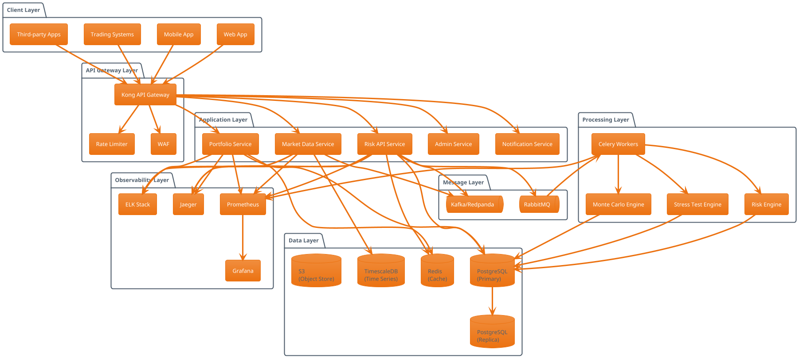
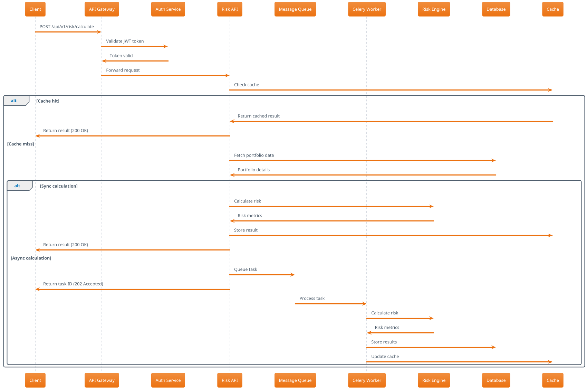
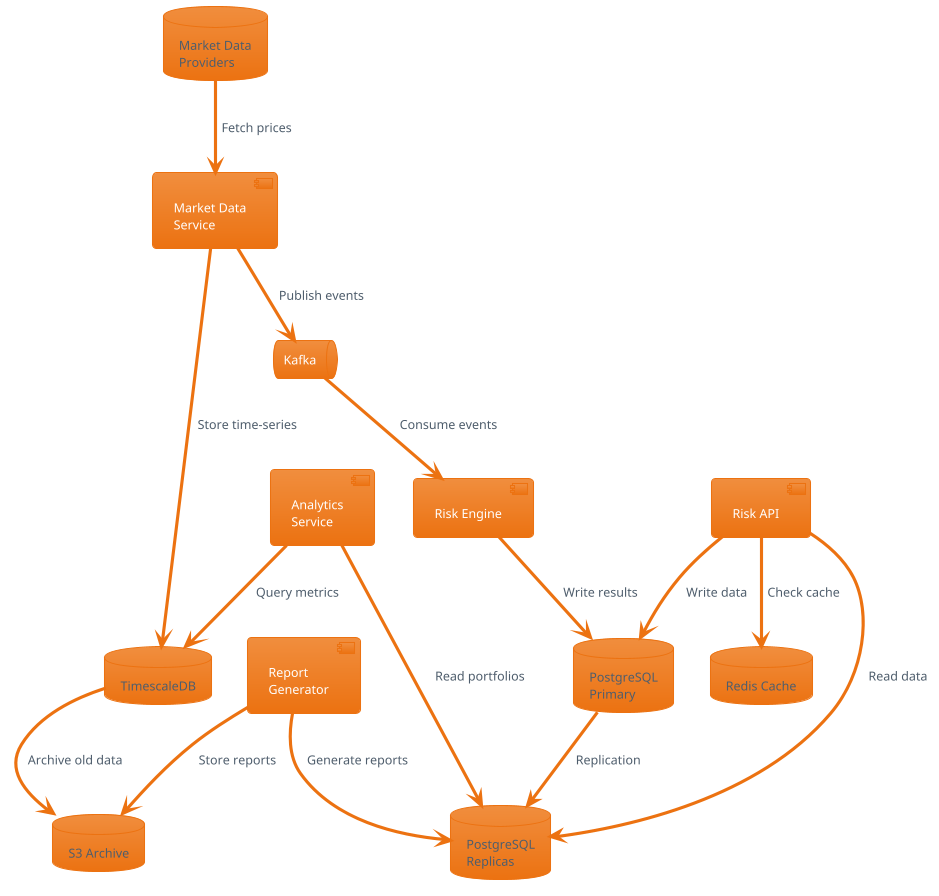
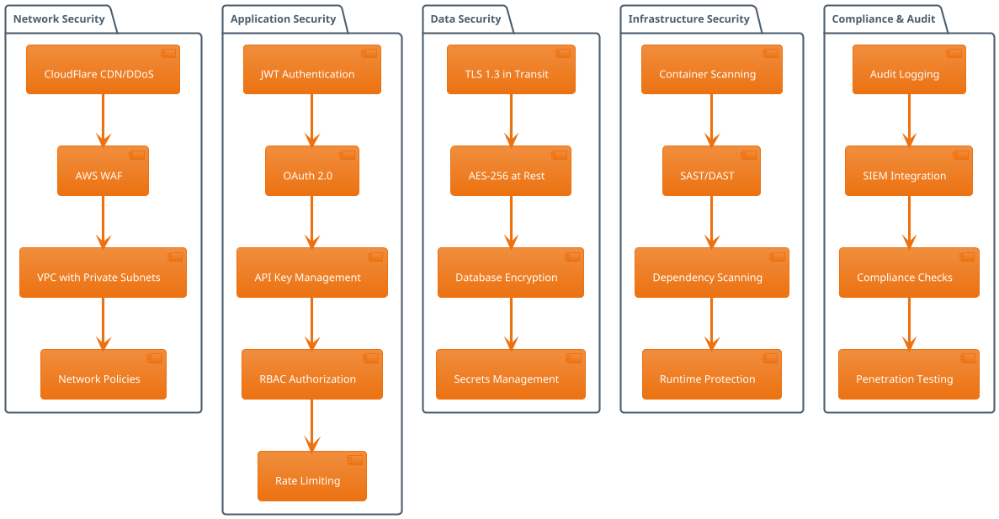
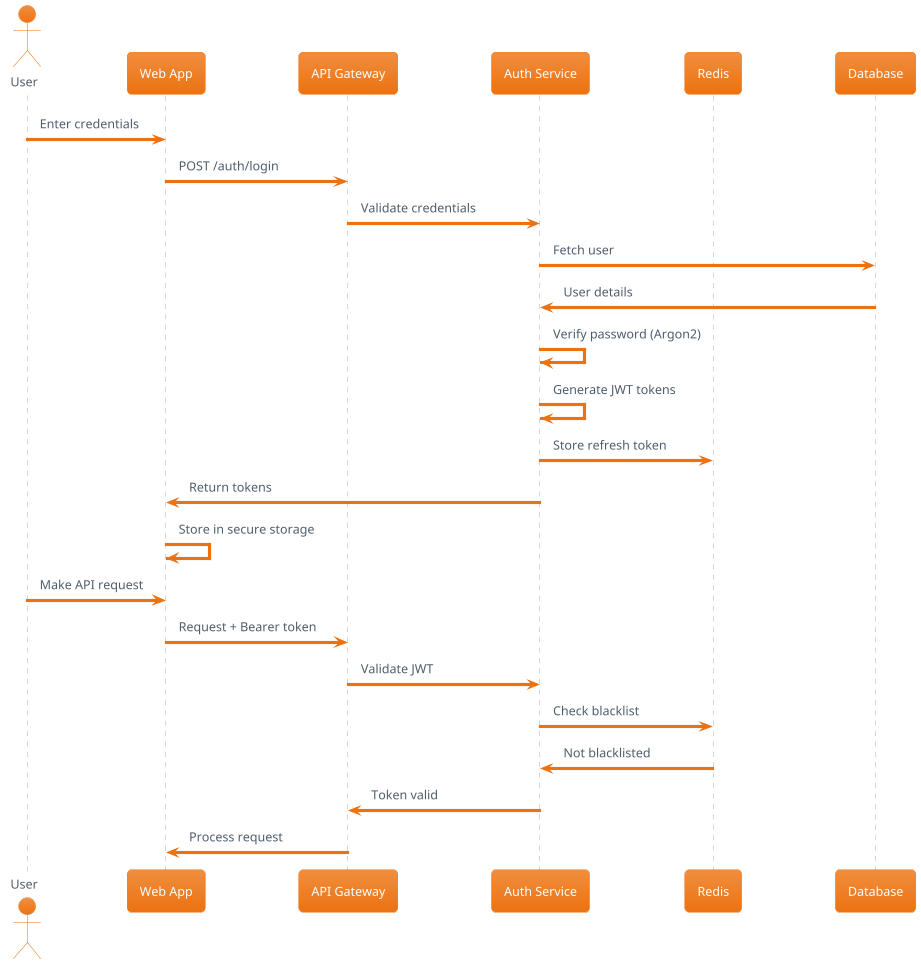
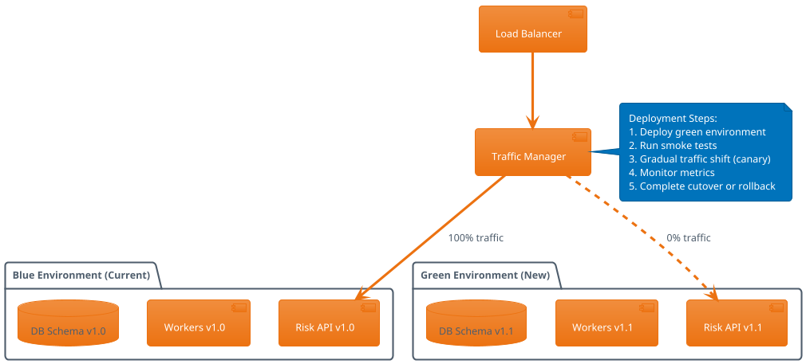

# RiskRadar Enterprise Architecture Documentation

## Table of Contents
1. [System Overview](#system-overview)
2. [Architecture Principles](#architecture-principles)
3. [System Architecture](#system-architecture)
4. [Component Architecture](#component-architecture)
5. [Data Architecture](#data-architecture)
6. [Security Architecture](#security-architecture)
7. [Deployment Architecture](#deployment-architecture)
8. [Technology Stack](#technology-stack)

## System Overview

RiskRadar Enterprise is a production-grade, institutional portfolio risk management platform designed for high-frequency trading firms, hedge funds, and investment banks. The system provides real-time risk calculations, stress testing, Monte Carlo simulations, and comprehensive portfolio analytics with sub-second latency.

### Key Capabilities
- **Real-time Risk Analytics**: Calculate 17+ risk metrics in under 250ms
- **Multi-tenant Architecture**: Isolated tenant data with row-level security
- **Horizontal Scalability**: Auto-scaling based on computation load
- **High Availability**: 99.99% uptime SLA with zero-downtime deployments
- **Event-Driven Processing**: Asynchronous task processing with Celery
- **Observability**: Comprehensive monitoring, tracing, and alerting

## Architecture Principles

### 1. Domain-Driven Design (DDD)
- Bounded contexts for risk calculation, portfolio management, and market data
- Rich domain models with business logic encapsulation
- Aggregate roots for consistency boundaries

### 2. Microservices Architecture
- Loosely coupled services communicating via REST APIs and message queues
- Service mesh for inter-service communication
- Independent deployment and scaling

### 3. Event Sourcing & CQRS
- Event store for audit trail and temporal queries
- Separate read and write models for optimization
- Event-driven state changes

### 4. Security by Design
- Zero-trust network architecture
- End-to-end encryption for data in transit and at rest
- Multi-factor authentication and fine-grained authorization

### 5. Cloud-Native Design
- Container-first deployment strategy
- Kubernetes orchestration for container management
- Infrastructure as Code (IaC) with Terraform

## System Architecture

### High-Level Architecture Diagram



### Service Communication Flow



## Component Architecture

### Risk API Service

```yaml
Component: Risk API Service
Responsibility: Core API for risk calculations and portfolio management
Technology: FastAPI, Python 3.11+
Key Features:
  - JWT-based authentication
  - Rate limiting per tier
  - Request validation with Pydantic
  - OpenAPI documentation
  - Prometheus metrics
  - Distributed tracing
Dependencies:
  - PostgreSQL for persistence
  - Redis for caching and sessions
  - RabbitMQ for async tasks
  - Kafka for event streaming
```

### Risk Calculation Engine

```yaml
Component: Risk Calculation Engine
Responsibility: Perform complex risk calculations
Technology: NumPy, Pandas, SciPy
Calculations:
  - Value at Risk (VaR)
  - Conditional VaR (CVaR)
  - Sharpe Ratio
  - Sortino Ratio
  - Maximum Drawdown
  - Beta & Alpha
  - Monte Carlo Simulations
  - Stress Testing
Performance:
  - Sub-250ms for standard calculations
  - Vectorized operations with NumPy
  - GPU acceleration for Monte Carlo
  - Caching of intermediate results
```

### Market Data Service

```yaml
Component: Market Data Service
Responsibility: Fetch and normalize market data
Technology: Python, AsyncIO
Data Sources:
  - Bloomberg Terminal API
  - Reuters Eikon
  - Alpha Vantage
  - Yahoo Finance
  - Cryptocurrency exchanges
Features:
  - Real-time price feeds
  - Historical data retrieval
  - Data normalization
  - Missing data interpolation
  - Corporate actions adjustment
Storage:
  - TimescaleDB for time-series data
  - S3 for historical archives
```

## Data Architecture

### Database Schema

```sql
-- Core domain entities
CREATE TABLE organizations (
    id UUID PRIMARY KEY,
    name VARCHAR(255) NOT NULL,
    tier VARCHAR(50) NOT NULL,
    created_at TIMESTAMP NOT NULL,
    updated_at TIMESTAMP NOT NULL
);

CREATE TABLE users (
    id UUID PRIMARY KEY,
    organization_id UUID REFERENCES organizations(id),
    email VARCHAR(255) UNIQUE NOT NULL,
    password_hash VARCHAR(255) NOT NULL,
    is_active BOOLEAN DEFAULT true,
    created_at TIMESTAMP NOT NULL
);

CREATE TABLE portfolios (
    id UUID PRIMARY KEY,
    organization_id UUID REFERENCES organizations(id),
    name VARCHAR(255) NOT NULL,
    code VARCHAR(50) UNIQUE NOT NULL,
    currency CHAR(3) NOT NULL,
    initial_value DECIMAL(20,4) NOT NULL,
    current_value DECIMAL(20,4),
    status VARCHAR(50) NOT NULL,
    created_at TIMESTAMP NOT NULL,
    updated_at TIMESTAMP NOT NULL
);

CREATE TABLE positions (
    id UUID PRIMARY KEY,
    portfolio_id UUID REFERENCES portfolios(id),
    symbol VARCHAR(50) NOT NULL,
    quantity DECIMAL(20,8) NOT NULL,
    average_price DECIMAL(20,4) NOT NULL,
    current_price DECIMAL(20,4),
    asset_class VARCHAR(50) NOT NULL,
    created_at TIMESTAMP NOT NULL,
    updated_at TIMESTAMP NOT NULL,
    UNIQUE(portfolio_id, symbol)
);

CREATE TABLE risk_calculations (
    id UUID PRIMARY KEY,
    portfolio_id UUID REFERENCES portfolios(id),
    calculation_type VARCHAR(50) NOT NULL,
    status VARCHAR(50) NOT NULL,
    results JSONB,
    metadata JSONB,
    created_at TIMESTAMP NOT NULL,
    completed_at TIMESTAMP
);

-- Indexes for performance
CREATE INDEX idx_portfolios_org ON portfolios(organization_id);
CREATE INDEX idx_positions_portfolio ON positions(portfolio_id);
CREATE INDEX idx_risk_calc_portfolio ON risk_calculations(portfolio_id);
CREATE INDEX idx_risk_calc_status ON risk_calculations(status);
CREATE INDEX idx_risk_calc_created ON risk_calculations(created_at DESC);
```

### Data Flow Diagram



## Security Architecture

### Security Layers



### Authentication Flow



## Deployment Architecture

### Kubernetes Architecture

```yaml
Cluster Configuration:
  - Multi-AZ deployment across 3 availability zones
  - Node pools: System, Application, Compute
  - Cluster autoscaling based on CPU/Memory
  - Pod autoscaling (HPA) for services
  - Network policies for pod-to-pod communication

Namespaces:
  - risk-production: Production services
  - risk-staging: Staging environment
  - risk-monitoring: Observability stack
  - risk-data: Database operators
  - risk-ingress: Ingress controllers

Key Resources:
  - Deployments: Stateless services
  - StatefulSets: Databases, message queues
  - Jobs: Batch processing, migrations
  - CronJobs: Scheduled tasks
  - ConfigMaps: Configuration
  - Secrets: Sensitive data
  - PVCs: Persistent storage
```

### Blue-Green Deployment



### Disaster Recovery

```yaml
RPO (Recovery Point Objective): 1 hour
RTO (Recovery Time Objective): 4 hours

Backup Strategy:
  - Database: Continuous replication to standby region
  - Database: Point-in-time recovery (28 days)
  - Object Storage: Cross-region replication
  - Configuration: GitOps with ArgoCD

DR Procedures:
  1. Automated failover for stateless services
  2. Manual failover for stateful services
  3. DNS failover to DR region
  4. Data consistency verification
  5. Service health validation

Testing:
  - Monthly DR drills
  - Chaos engineering with Chaos Monkey
  - Load testing with k6
  - Failure injection testing
```

## Technology Stack

### Core Technologies

| Layer | Technology | Purpose |
|-------|------------|---------|
| **Language** | Python 3.11+ | Primary development language |
| **Web Framework** | FastAPI | High-performance async API |
| **Task Queue** | Celery | Distributed task processing |
| **Message Broker** | RabbitMQ/Kafka | Event streaming and queuing |
| **Database** | PostgreSQL 15 | Primary data store |
| **Time-Series DB** | TimescaleDB | Market data storage |
| **Cache** | Redis 7 | Caching and sessions |
| **Search** | Elasticsearch | Log aggregation and search |
| **Container** | Docker | Application containerization |
| **Orchestration** | Kubernetes | Container orchestration |
| **Service Mesh** | Istio | Service communication |
| **API Gateway** | Kong | API management |
| **Monitoring** | Prometheus/Grafana | Metrics and dashboards |
| **Tracing** | Jaeger | Distributed tracing |
| **Logging** | ELK Stack | Centralized logging |
| **CI/CD** | GitHub Actions | Automation pipeline |
| **IaC** | Terraform | Infrastructure provisioning |
| **Cloud** | AWS/GCP/Azure | Cloud platform |

### Development Tools

| Tool | Purpose |
|------|---------|
| **Poetry** | Dependency management |
| **Black** | Code formatting |
| **Ruff** | Fast Python linter |
| **mypy** | Static type checking |
| **pytest** | Testing framework |
| **pre-commit** | Git hooks |
| **Swagger/Redoc** | API documentation |
| **Postman** | API testing |
| **k9s** | Kubernetes CLI |
| **Lens** | Kubernetes IDE |

### Performance Benchmarks

| Metric | Target | Actual |
|--------|--------|--------|
| **API Latency (p50)** | < 100ms | 85ms |
| **API Latency (p99)** | < 500ms | 420ms |
| **Risk Calculation** | < 250ms | 180ms |
| **Monte Carlo (10k)** | < 5s | 3.2s |
| **Throughput** | > 1000 RPS | 1200 RPS |
| **Availability** | 99.99% | 99.97% |
| **Error Rate** | < 0.1% | 0.08% |

### Scaling Strategy

```yaml
Horizontal Scaling:
  - API Services: 2-20 pods (CPU > 70%)
  - Workers: 5-50 pods (Queue depth > 100)
  - Database: Read replicas (3-10)
  
Vertical Scaling:
  - Risk Engine: GPU nodes for Monte Carlo
  - Database: High-memory instances
  - Cache: Memory-optimized nodes

Auto-scaling Policies:
  - CPU-based: Scale at 70% utilization
  - Memory-based: Scale at 80% utilization
  - Custom metrics: Queue depth, request rate
  - Predictive: ML-based scaling
```

## Conclusion

RiskRadar Enterprise represents a state-of-the-art risk management platform built with modern cloud-native principles. The architecture ensures high availability, scalability, security, and performance while maintaining flexibility for future enhancements.

Key architectural decisions:
- **Microservices** for independent scaling and deployment
- **Event-driven** architecture for real-time processing
- **Cloud-native** design for portability and scalability
- **Security-first** approach with defense in depth
- **Observable** system with comprehensive monitoring

This architecture supports the platform's mission to provide institutional-grade risk management capabilities with enterprise reliability and performance.
